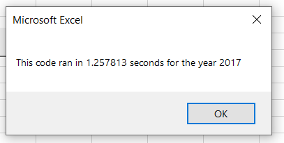
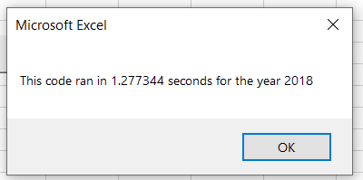
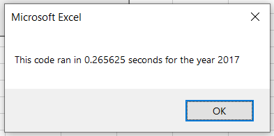
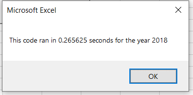
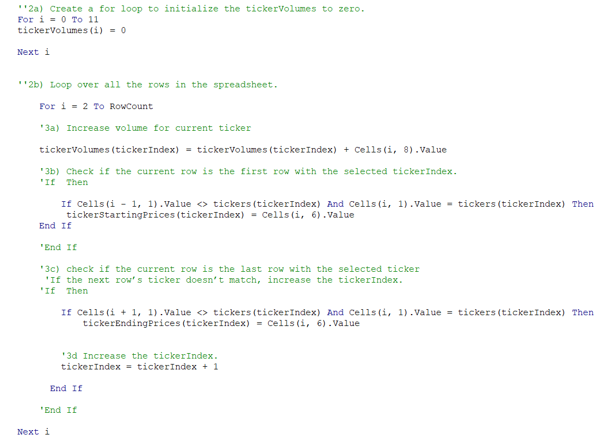

# Module 2 - VBA Challenge

## Overview of Project

### Background
Steve loves the workbook that was prepared for him. At the click of a button, Steve can analyze an entire dataset. Now, to do a little more research for his parents, he wants to expand the dataset to include the entire stock market over the last few years. Although the code works well for a dozen stocks, it might not work as well for thousands of stocks. And if it does, it may take a long time to execute.

### Purpose
Make the Module 2 code more efficient by Refactoring. Determine whether refactoring the code makes the VBA script run faster.  Provide Steve with the same data analysis that was provided in the greenstocks workbook.

## Results
Refactoring the code made the VBA script run faster compared to the original. As seen in the screenshots below, the run time from the original VBA Script in Greenstocks workbook was approximately 1.2 seconds for both analysis of 2017 and 2018. 

After refactoring the code, the run time for the new VBA Script for both 2017 and 2018 datasets was around 0.2 seconds. This run time is approximately 1 second faster compared to the original. 

The original script contained a nested loop. The refactored script removed the nested loop and created a separate loop for the Output. Below is a screenshot of the refactored code:

## Summary

### Advantages & Disadvantages of Refactoring Code
Refactoring code in general has many advantages:
  - helps the code run more efficiently by running fewer steps
  - uses less memory
  - improves logic of the code to make it easier for future users to read

Disadvantages of refactoring code:
- Time consuming
- Can introduce new bugs
- Can get lost in the code if you do not know which direction to go, or if you do not understand how to refractor the code

### Advantages & Disadvantages of the Original and Refactored VBA Script
The main advantage of the refactored VBA script is that the code ran faster compared to the original script. The Refactored script ran the analysis and formatted all in one, this made it more efficient and user friendly. compared to the original script from the module which required the user to run the analysis and formatting on 2 different steps.

Disadvantage of the Refactored script was the time needed to complete it successfully. The time spent refactoring the code was not worth the result of saving 1 second of time that it took the Original VBA to run. If the dataset were larger and to run the original VBA script took hours to loop through the data, I would understand the need and want to have a refactored script. To only save a few seconds off the run time was not worth the hours of work needed to successfully refactor the script.
